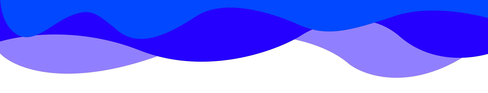

 

<h1 style="border-bottom: 3px solid #c0ff09 ; padding: 15px; font-weight: 700;">Hello folks  I'm Luan, a student of Full Stack development</h1>

I am currently studying systems analysis and development with completion expected in 2024. I started learning to program in 2019, and until then I learned some technologies, frameworks and Front-End libs. But right now, I'm focused on becoming a Full Stack developer with the help of [Kenzie Academy](https://kenzie.com.br/), a programming school.

<h4>Curiositie's about me:</h4>

- 🪐 I love things about space and the universe.
- ⚽ I'm in love with football.
- 🎬 The movie 'Interstellar' and the Netflix serie 'Dark' are my favorite movies and series.

<h3>Knowledges</h3>

<h3>Talk with me</h3>

<q>Perform every act of your life as if it were your last.</q>

Aurelio, Marco.

